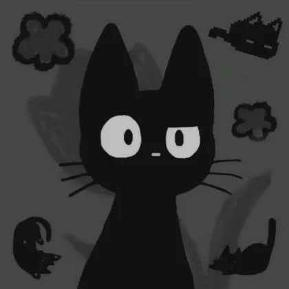
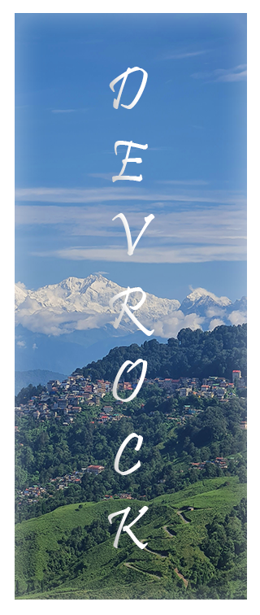

 
 

 
  
- Name: **Dev Bhakat** (You can call me **devrock** or **zenithsenpai**)

- A **High School Student** from **India** 🇮🇳  
- Age: **18**

- Good with **JavaScript**, **Node.js**, **Python**, **HTML**, **CSS**  
- Familiar with **Windows**, **Debian**, and **Linux**

- Languages: **Hindi**, **English**, **Bengali**

 
 

 
 
  
- 🧰 [***devrock07/rock-cloner***](https://github.com/devrock07/rock-cloner)  
  A **Discord Server Cloner** with fast setup and simple commands.
- ⚙️ [***devrock07/RockV3-Selfbot***](https://github.com/devrock07/RockV3-Selfbot)  
  A **Discord Selfbot** designed for automation and customization.
 

  
*“Keep building. Keep breaking. That’s how you grow.” – Dev Bhakat*

